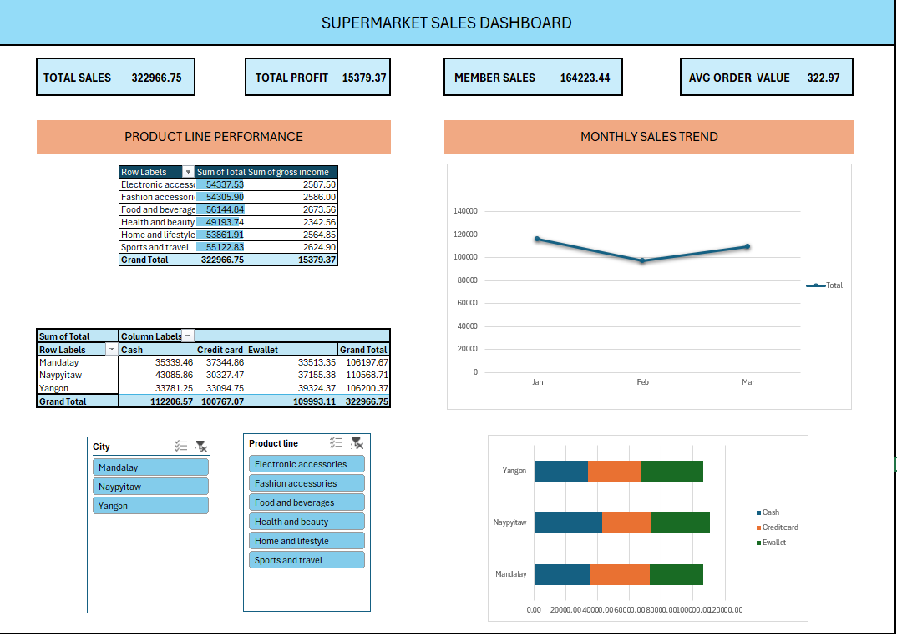

Retail Sales Performance Dashboard

Business Problem

A supermarket chain with 3 branches wants to understand which product lines are bringing in the most sales and profit, how sales change from month to month, how customers use different payment methods across cities, and whether Member customers are spending more than Normal customers.

Dataset

Supermarket Sales (Kaggle) — 1,000 transactions from 3 branches: Mandalay, Naypyitaw, and Yangon.

Tools

Excel — Power Query, PivotTables, Slicers, SUMIFS, AVERAGEIFS and Conditional Formatting.

Key Insights

1. Food and Beverages had the highest sales at 56,144.84, followed by Sports and Travel at 55,122.83. The other product lines were also fairly close, ranging from about 49K to 55K.
2. Profit margin was around 4.76% across all product lines, so there wasn't a major difference in margin between categories.
3.  Sales dropped from 116,291.87 in January to 97,219.37 in February, a decrease of about 16%, before recovering to 109,455.51 in March.
4. Payment methods varied between cities. Naypyitaw had the highest share of Cash payments at around 39%, while Yangon had the highest E-wallet usage at around 37%.
5. Members spent slightly more per order on average than Normal customers — 327.79 compared to 318.12, around a 3% difference.

Recommendation

Food and Beverages has the highest sales, but the product lines are fairly close to each other and have the same profit margin. Because of this, I'd focus more on overall sales volume rather than trying to push one category based on profit margin.

The February drop in sales and the differences in payment methods between cities are worth keeping an eye on. However, with only 3 months of data, I'd want to look at a longer period before making any major decisions.

Members do spend a little more per order, but the difference is only around 3%. I'd compare this extra revenue with the actual cost of running the Member program before deciding whether it's giving the business enough value.

DASHBOARD

Files in this repo

1. Supermarket_Dashboard.xlsx — Excel workbook containing the Data and Dashboard tabs
2. screenshot/dashboard.png — Dashboard preview
